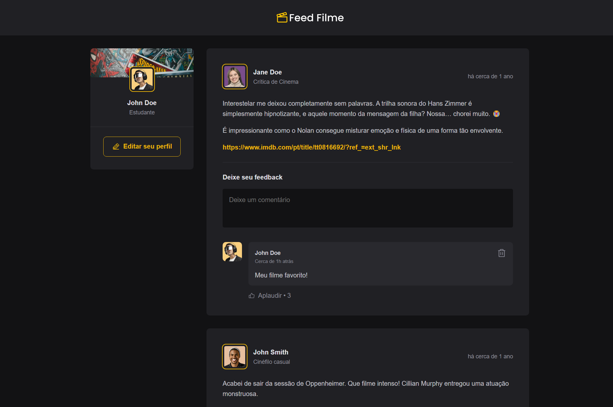

[TYPESCRIPT__BADGE]: https://img.shields.io/badge/typescript-3178C6?style=for-the-badge&logo=typescript&logoColor=fff
[REACT__BADGE]: https://img.shields.io/badge/React-20232A?style=for-the-badge&logo=react&logoColor=61DAFB
[VITE__BADGE]: https://img.shields.io/badge/Vite-646CFF?style=for-the-badge&logo=vite&logoColor=fff

<h1 align="center" style="font-weight: bold;">Feed Filme 🎬</h1>

<p align="center">
  
  
  
</p>

<p align="center">
 <a href="#about">Sobre</a> • 
 <a href="#started">Instalação</a>
</p>

<p align="center">
    
</p>

<h2 id="about">📌 Sobre</h2>

O **Feed Filme** é uma aplicação web simples e interativa onde os usuários podem compartilhar opiniões sobre filmes e séries que assistiram recentemente. Inspirado no projeto desenvolvido durante a formação *ReactJS* da Rocketseat (nível 01 - Fundamentos), este projeto tem como objetivo aplicar os principais conceitos do ecossistema React em uma interface amigável e funcional.

Apesar de não possuir persistência de dados (os dados são salvos apenas em memória), o projeto é um ótimo ponto de partida para quem está aprendendo sobre estados, componentes, propriedades, renderização condicional e manipulação de eventos em React.

### ✨ Funcionalidades:

- Visualizar publicações feitas por outros usuários;
- Comentar em qualquer post visível;
- Curtir comentários;
- Excluir seus próprios comentários.

---

<h2 id="started">🚀 Instalação</h2>

Para rodar este projeto você precisa ter alguns pré-requisitos instalados.

<h3>📦 Pré-requisitos</h3>

- Node.js (versão recomendada: 18 ou superior)
- npm ou yarn

<h3>📁 Clonando o projeto</h3>

```bash
git clone https://github.com/joaoev/feed-filme.git
```

<h3>▶️ Iniciando o projeto</h3>

```bash
cd feed-filme
npm install
npm run dev
```

<div align="center"> Feito com 💙 usando React + TypeScript + Vite </div>
